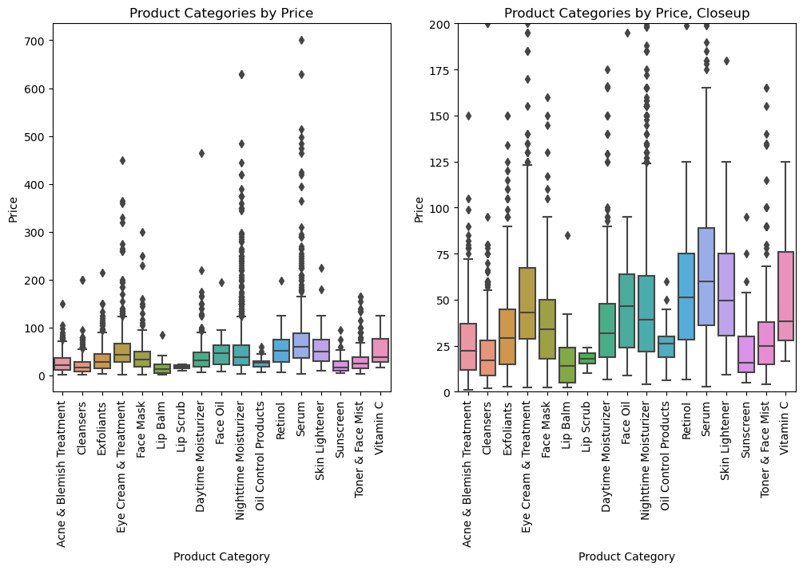
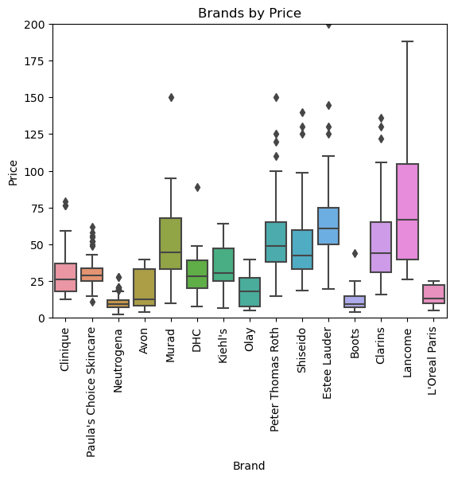
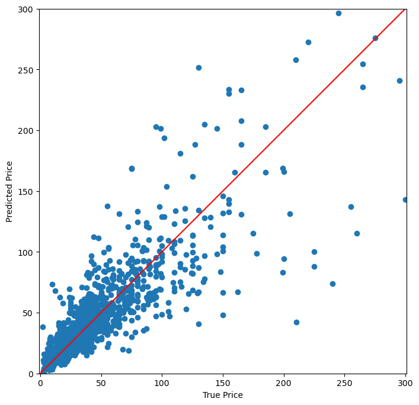
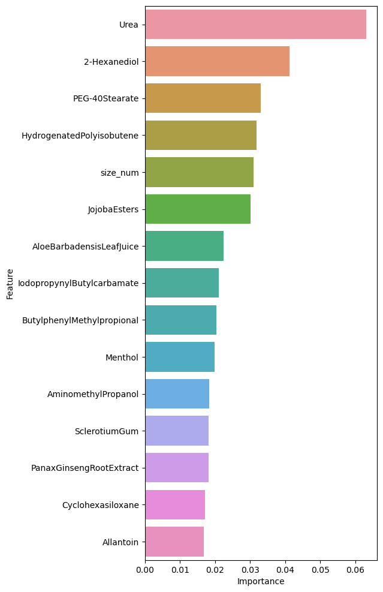

# Predicting Prices in Skincare Using Advanced Machine Learning


## Overview
According to Clarkston Consulting, the global skincare market was worth $146 billion in 2021 and is expected to grow to $207.22 billion by 2028. Skincare in particular has seen an increased interest as the culture has shifted away from the glam beauty standards of the recession-era 2000s to embrace a more "natural" beauty.

My stakeholder, Inner Glow Inc., wants to make their mark on the skincare industry by coming out with their own line of products that are competetive with what's available. To do this, they first need to understand the current market and determine where they can undercut more expensive alternatives. Rampant upcharge in the skincare industry is obvious when products can range from $7-400. How can Inner Glow Inc. offer mid-line products that capture both a high-end and low-end market?

## The Data 

I use data from NoxMoon's "Inside Beauty" project, scraped from Beautypedia and Paula’s choice websites by [NoxMoon](https://github.com/NoxMoon/inside_beauty), and data I scraped myself from the Dermstore. The two datasets include product names, brands, prices, ingredients, size, and product type. There are over 7000 products at the end of cleaning. Features include one-hot encoded "special" ingredients (i.e. not ones that appear in every single product but do in a good amount of them), and number of active and inactive ingredients, among others.





## Modeling and Results

After tuning a series of neural networks, using XGBoost, using grid search to tune XGBoost, and stacking Random Forest, SVR, and XGBoost, I find in the end that the untuned XGBoost does the best with the data, scoring an MAE on the test around $13. Given the spread of product prices, this doesn't seem way off base. 



Features engineering determines certain ingredients, like Urea, have a marginal level of importance when it comes to price. 



## Recommendations and Next Steps

The most often overpriced brands are La Prairie, Dr. Brandt, and Shiseido, while the most underpriced ones are Neutrogena, Shiseido, and Mary Kay. Therefore, Inner Beauty Inc. should try to dupe the overpriced brands' products with prices that are on average higher than the underpriced ones.

For next steps, I'd like to dig more deeply into the ingredients to determine which combinations of ingredients are the most profitable. I'd also like to look at packaging using image classification since packaging signals the quality of the product to customers. Finally, I'd want to determine which categories Inner Beauty should focus on.

I put all my findings together into the Streamlit app SuperDuper which offers users the chance to dupe their favorite high-end products and find cheaper alternatives that are at the ingredient-level similar.

[Find the app here.](https://npagrawal-product-price-prediction--superduper-streamlit-ftfs2j.streamlit.app/)


## Repository Structure
```
├── data
├── images
├── scraping
├── Analysis_Notebook.ipynb
├── README.md
├── features.pkl
├── presentation.pdf
├── requirements.txt
└── superduper_streamlit.py
```
